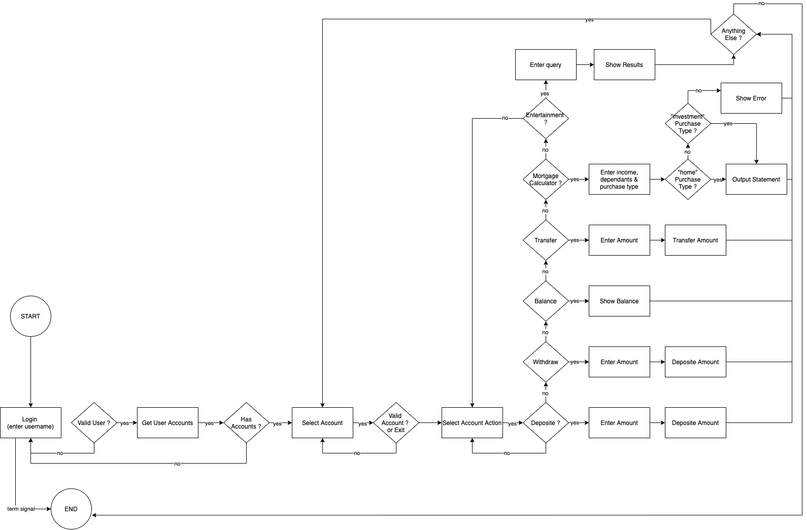

**Question 4:** Provide a link to your source control repository

```
https://github.com/pduong987/DuongPham_T1A3.git
```


______

**Question 5:**  Design a **Software Development Plan** for a terminal application.

**Develop** a statement of **purpose** and **scope** for your application. It must include:
\- **describe** at a high level what the application will do
\- **identify** the problem it will solve and **explain** why you are developing it
\- **identify** the target audience
\- **explain** how a member of the target audience will use it

_____

# 				**Bank Smart Terminal App**


#### **App Goal:** 

This bank app will provide an overview of how the Bank Smart Terminal App work. The primary purpose of the app is to provide an easy way to use and simplified banking experience, e.g simple display of what you want to see without extra functionality. Banking is not difficult when things are listed clearly, as anyone can understand it. Outstanding balance, bank details, deposit, bills pay, saving, mortgager or even retirement plans can be calculated in an accessible way with innovative technology so you can save lots of time in modern life. During Covid and increased streess, people will tend to spend more money on going out, takeaways and a short trips inside the country. The Bank Smart Terminal App can also recommend which locations to visit, which restaurant and where to spend an your time, doing fun activities. 


#### Problem and Solving:


***Problem:***

There are too many options on other bank apps nowadays. It causes a complication for users. Also, people don't have time to check those option out. Bank apps should just be simple and easy to use.


##### ***Solving:***

The app will just be simple and get to the point. 

The app will provide an easy display and options.


| Target Audience |                          Use-Cases                           |
| :-------------- | :----------------------------------------------------------: |
| 1.Student       | Students can transfer money to friends or family member after meal or drink. |
| 2.Professional  | Professionals can transfer money , find out mortgage information, or look for ideal place to go on the weekend. |
| 3.Senior        | Seniors can easily deposit or withdraw their money , check bank balances or places to go anytime during the weekday or weekend. |


_____

**Question 6:** **Develop** a list of features that will be included in the application. It must include:
\- at least THREE **features**
\- **describe** each feature

________

### 									            Features use in the Bank Smart app:


| Type                  | Description                                                  |
| --------------------- | ------------------------------------------------------------ |
| 1. Login In/ Log Out  | The Ruby terminal app is more straightforward than the modern world, with a lot of security checking to Log In and Out of the bank in real life.  This Bank Smart app will provide a simple User log-ins with some data created already inside a hash that wait to be called out. The user needs to enter their name to Log In to the bank app to check their account balance. Therefore they can do other functions such as deposits or withdrawing their money, transferring between bank account or checking popular entertainment places that link to the Bank Smart app. |
| 2. Deposite/ Withdraw | The Bank Smart app allows them to draw money from their account. Each account has a current balance which will decrease every time withdrawal happen. At the same time, the account balance will increase if the User puts money in the Deposit account. |
| 3. Transfer           | As users' details are already set up, the User can transfer money between the bank account and the bank balance. Bank balance will be changed as money has been moving around between all those banks. Therefore, the amount balance in each bank account also increases or decreases depending on what action the User makes. |
| 4. Mortgage           | User will be asked for some personal detail of how much they earn in a year, expenses each month, and how much the house they want to buy with the mortgage option. The mortgage calculator which got desire in the app will do the calculation at the back end to see if the User can have a mortgage. The Bank Smart app would give them some details to book in a meeting with a proper banker to get a mortgage if they qualified to do so. Other than that, the Bank app will let them know that they can not get a mortgage and move to another function if they want to. |
| 5. Entertainment      | Users will be asked if they want to do something fun and provide and input to ask the terminal app. Under the covers this "query" is sent directly to the Google Places API which will return a range of suggestions such as "pizza near surry hills". The user can then select one of the places, with a simple message being returned. |


___________

**Question 7:** **Develop** an **outline** of the user interaction and experience for the application.
Your outline must include:
\- how the user will find out how to interact with / use each feature
\- how the user will interact with / use each feature
\- how errors will be handled by the application and displayed to the user

The Bank Smart app uses a simple menu selection system and loops to allow the user navigate the application.

Per Question 8 flow diagram, a user interacts with the application as follows:

1. **Start Application (e.g run-unix.sh)**

   The app fires!

2. **User provides username**

   The username is used to identify the user within our JSON database (See username field)

3. **User selects one of their accounts**

   A user will be presented with a list of all their available accounts for selection

4. User selects an action for the account

   Based on the selected account, the user can select an action such as Deposit or Account

5. **Asks if user wants to continue**

   The user is then asked if they want to perform another action. If they do they select the next action, else go back to login


**<u>Error Handling</u>**

Through the control flow there are if else blocks and resuce statements to prevent failure

Further to this, a series of sub while loops control which menu to show

With a final sigterm (Signal Termination) being used to exist the application entirely

_________


_______

**Question 8:** **Develop** a diagram which describes the control flow of your application. Your diagram must:
\- show the workflow/logic and/or integration of the features in your application for each feature.
\- utilise a recognised format or set of conventions for a control flow diagram, such as UML.

____




____________

**Question 9: Develop** an implementation plan which:
\- **outlines** how each feature will be implemented and a checklist of tasks for each feature
\- prioritise the implementation of different features, or checklist items within a feature
\- provide a deadline, duration or other time indicator for each feature or checklist/checklist-item

Utilise a suitable project management platform to track this implementation plan

\> Your checklists for each feature should have at least 5 items.

------

Please refer to Trello board screenshots in doc directory.

----


**Question 10:** **Design** help documentation which includes a set of instructions which accurately **describe** how to use and install the application.

You must include:
\- steps to install the application
\- any dependencies required by the application to operate
\- any system/hardware requirements

____

```
git clone https://github.com/pduong987/DuongPham_T1A3.git
cd ./DuongPham_T1A3/src
bundle install
chmod u+x run-unix.sh
./run-unix.sh
```

